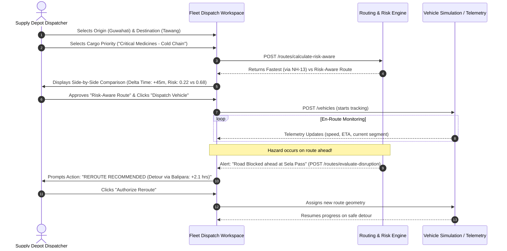
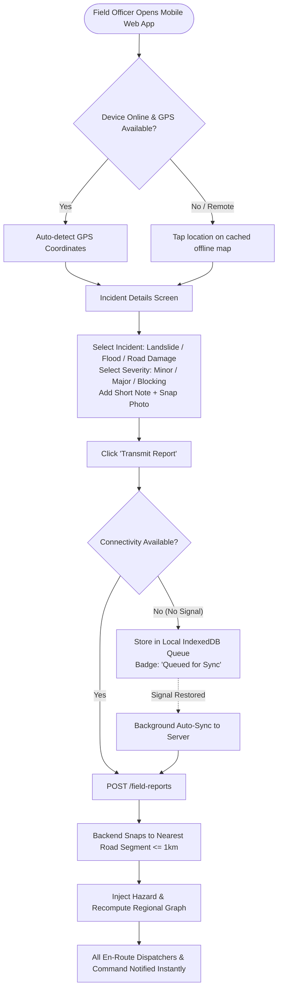
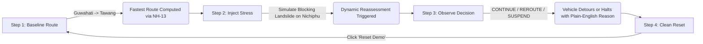

# User Flows & Interface Architecture Design
## AI-Enabled Smart Logistics & Accessibility Intelligence Platform (NER)

### 1. The Problem With the Current Dashboard: Why It Feels Chaotic

Currently, the frontend (`App.jsx`) stacks **12 different operational widgets** into two side rails flanking a single map:
* **Left Rail:** `RoutePlanner` + `WeatherControls` + `HazardControl`
* **Right Rail:** `SegmentDetailPanel` + `AlertPanel` + `AlertCenter` + `RouteSummary` + `RouteComparison` + `RiskBreakdown` + `FieldReportPanel` + `VehiclePanel`
* **Bottom:** `EventTimeline`

#### Why This Breaks in Real-World Use (and Hackathon Demos):
1. **Persona Collision:** A field worker in Arunachal Pradesh reporting a rockfall is forced to look at truck speedometers, historical IMD NetCDF selectors, and Dijkstra risk weight breakdowns.
2. **Cognitive Overload:** When an incident occurs, 4 different panels light up simultaneously (`AlertCenter`, `AlertPanel`, `HazardControl`, `RouteDecision`), confusing the user on who is supposed to take action.
3. **Demo / Sandbox Entanglement:** Testing tools (e.g., "Simulate 0.9 Severity Landslide") sit directly next to operational operational tools (e.g., "Submit Field Report"), blurring the line between real data and simulated inputs for judges.

---

### 2. The 4 Distinct User Personas & Workspaces

The platform should be decoupled into **4 Dedicated Workspaces** accessible via a top navigation bar:

```
┌─────────────────────────────────────────────────────────────────────────────────────────┐
│  [NER-LOGISTICS LOGO]   1. Command Center   2. Fleet Dispatch   3. Field Report   4. Lab│
└─────────────────────────────────────────────────────────────────────────────────────────┘
```

| Persona | Role & Objectives | Dedicated Workspace | Primary Tasks |
|---|---|---|---|
| **1. Regional Command (SDMA / DDMA / BRO)** | Macro oversight of regional accessibility, isolated districts, and high-risk corridors. | **Command Center (Regional GIS)** | Monitor district cut-off statuses, active regional alerts, critical bottlenecks, and approve emergency detour corridors. |
| **2. Logistics Dispatcher (Depot / Supply Chain)** | Moving essential commodities (medicines, rations, fuel) safely from depots to hill stations. | **Fleet & Route Dispatcher** | Plan routes, compare Fastest vs. Risk-Aware paths, dispatch vehicles, track live progress, and authorize reroutes. |
| **3. Field Official / First Responder** | On-the-ground reporting of road breaches, landslides, and bridge damage from mobile devices. | **Field Reporting Portal (Mobile-First)** | Tap map / GPS to log incident, attach photo, indicate road blockage, and mark resolved once cleared. |
| **4. Disaster Lab / Evaluator (SIH Demo)** | Stress-testing the network with hypothetical weather and synthetic disruptions. | **Simulation & Stress Lab** | Inject multi-segment hazards, run "what-if" monsoon scenarios, test vehicle rerouting, and reset demo baseline. |

---

### 3. Detailed Step-by-Step User Flows

---

#### User Flow 1: Logistics Mission Planning & Adaptive Dispatch
**Primary Actor:** Supply Depot Manager (e.g., Guwahati Medical Supplies Depot)  
**Objective:** Deliver temperature-sensitive medicines to Tawang District Hospital without getting stranded.



**Step-by-Step Screen Progression:**
1. **Origin/Destination Selection:** Minimalistic dispatch form with auto-complete and commodity priority presets (Medical, Food, Heavy Machinery).
2. **Trade-Off Modal:** Instead of 6 cluttered text cards, show a clear **Safety vs. Speed Decision Matrix**:
   - *Option A (Fastest):* 14 hrs 30 mins | ⚠️ High Risk (Steep grade + heavy rainfall expected near Nichiphu).
   - *Option B (Recommended Safe):* 15 hrs 45 mins | 🛡️ Low Risk (Avoids unstable mountain cuts).
3. **Live Mission Tracker:** The map focuses strictly on the active convoy with a progress scrub bar, speed, remaining fuel/battery, and next critical checkpoint.

---

#### User Flow 2: Field Official Incident Logging (Mobile / Low-Bandwidth)
**Primary Actor:** Border Roads Organisation (BRO) Field Engineer or Local Traffic Police  
**Objective:** Report a sudden debris slide blocking NH-13 between Bhalukpong and Bomdila.



**Step-by-Step Screen Progression:**
1. **Fullscreen One-Thumb Action:** Large primary button: `[ + REPORT ROAD INCIDENT ]`.
2. **Simplified 3-Step Wizard:**
   - *Step 1: Location:* "Use Current Location" (auto-filled) or "Tap Map".
   - *Step 2: Type & Severity:* Big touch-friendly chips (`[Landslide]`, `[Flooding]`, `[Bridge Damage]`, `[Road Blocked]`).
   - *Step 3: Notes & Photo:* Camera capture button with quick damage description.
3. **Instant Feedback:** Shows: *"Report submitted. Road marked BLOCKED. 3 approaching vehicles are being rerouted."*

---

#### User Flow 3: Regional Command Center (SDMA / Disaster Management)
**Primary Actor:** State Disaster Management Authority (SDMA) Director  
**Objective:** Assess which hill districts are at risk of being completely cut off during a 48-hour monsoon surge.

**Key Dashboard Panels:**
1. **District Isolation Status Matrix (Top Bar):**
   - 🟢 *Guwahati:* Accessible (100%)
   - 🟡 *West Kameng:* Degraded (Alternate routes active, +3.5h delay)
   - 🔴 *Tawang:* Critical Alert (Single artery remaining, 85% risk threshold)
2. **Corridor Vulnerability Heatmap (Map):**
   - Segments color-coded by composite vulnerability: Green (Normal), Amber (High Slope / Saturated Soil), Red (Severed / Impassable).
3. **Emergency Action Queue (Sidebar):**
   - Filter active incidents by district.
   - One-click export of inaccessible road manifests for emergency air-drop or BRO clearance deployment.

---

#### User Flow 4: Simulation & Stress Lab (Hackathon / Judge Mode)
**Primary Actor:** Hackathon Judge, System Tester, or Operations Planner  
**Objective:** Demonstrate that the platform's hazard-aware routing reliably beats traditional shortest-path algorithms under stress.



**What Belongs in this Workspace:**
* The **Simulate Hazard Panel** (pick segment, pick event, set severity).
* The **Historical IMD Rainfall Date Selector** (`2023-06-21` extreme monsoon slider).
* The **Side-by-Side Algorithmic Telemetry** (Dijkstra edge cost curves, factor breakdown: slope vs. GSI vs. precipitation).
* The **One-Click Demo Reset Button** (`POST /simulation/reset`).

---

### 4. Proposed Frontend UI Architecture (Tabs / Workspaces)

Instead of squeezing 12 components into one layout, `App.jsx` should transition to a **Tabbed / Workspace Shell**:

```jsx
// Recommended App Layout Structure
export default function App() {
  const [activeTab, setActiveTab] = useState("dispatch"); // "command" | "dispatch" | "field" | "lab"

  return (
    <div className="app-shell">
      <Header activeTab={activeTab} onTabChange={setActiveTab} alertCount={activeAlerts} />

      <main className="app-workspace">
        {activeTab === "command" && <CommandCenterWorkspace network={network} alerts={alerts} />}
        {activeTab === "dispatch" && <FleetDispatchWorkspace network={network} onVehicleUpdate={...} />}
        {activeTab === "field" && <FieldReportingWorkspace onReportSubmitted={...} />}
        {activeTab === "lab" && <SimulationLabWorkspace network={network} onReset={...} />}
      </main>

      <EventTimeline events={timelineEvents} />
    </div>
  );
}
```

### 5. Summary of Cleaned-Up User Experience

| Before (Current State) | After (Proposed Flow Architecture) |
|---|---|
| 1 monolithic page with 12 stacked panels | 4 clean, role-oriented workspaces (Command, Dispatch, Field, Lab) |
| Field officer sees truck speed & demo sliders | Field officer has a 3-step, mobile-friendly reporting screen |
| Demo hazard controls mixed with real reports | Simulation controls isolated in a dedicated "Stress Lab" workspace |
| Unclear who acts when a reroute occurs | Dispatcher gets a clear "Approve Reroute (+45 min)" action prompt |
| Cluttered sidebar pushing panels off-screen | Focused contextual sidebars showing only what the current user needs |
