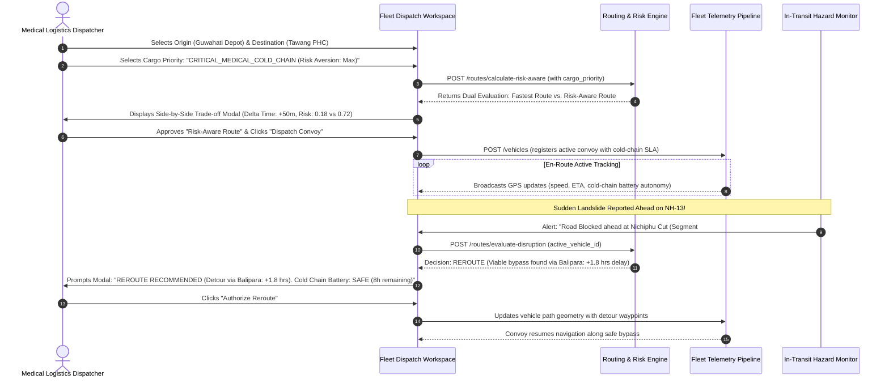
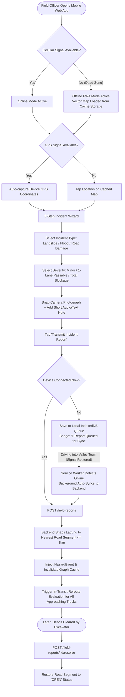
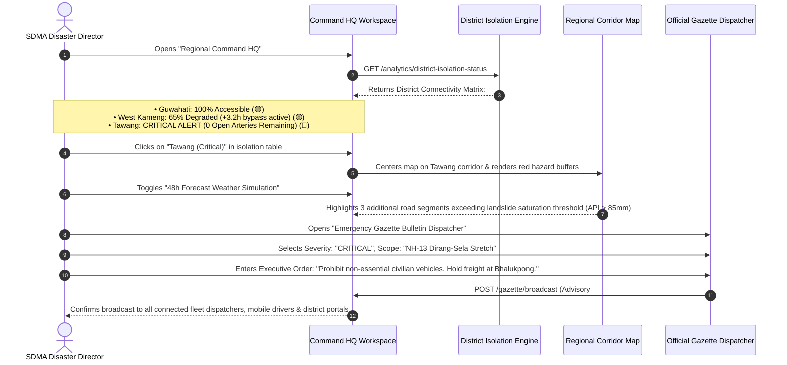
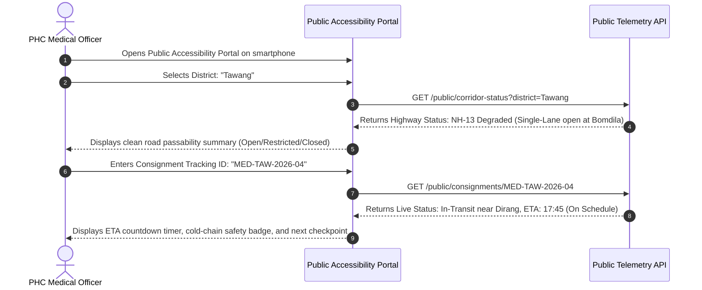

# User Flows & Interface Architecture Design
## AI-Enabled Smart Logistics & Accessibility Intelligence Platform for North Eastern Region (NER)

> **Document Type:** User Experience, Operational Workflow & UI Architecture Specification  
> **Problem Statement ID:** 26002 (MDoNER)  
> **Reference Document:** [COMPREHENSIVE_PS_STAKEHOLDER_USP_ANALYSIS.md](./COMPREHENSIVE_PS_STAKEHOLDER_USP_ANALYSIS.md)  
> **Git Branch:** `feature/ps-26002-requirements-stakeholder-analysis`  

---

## 1. The Operational Problem: Deconstructing Dashboard Clutter

Currently, the prototype frontend (`App.jsx`) mounts **12 competing operational widgets** simultaneously into two side rails flanking a central map:
- **Left Rail:** `RoutePlanner` + `WeatherControls` + `HazardControl`
- **Right Rail:** `SegmentDetailPanel` + `AlertPanel` + `AlertCenter` + `RouteSummary` + `RouteComparison` + `RiskBreakdown` + `FieldReportPanel` + `VehiclePanel`
- **Bottom Shelf:** `EventTimeline`

### Why This Breaks in Real-World Operations & Evaluator Demos:
1. **Persona Collision & Operational Role Confusion:**  
   A Border Roads Organisation (BRO) field engineer attempting to report a mudslide on NH-13 from a smartphone is confronted with truck speedometers, historical IMD NetCDF file date selectors, and Dijkstra risk-weight sliders.
2. **Cognitive Overload During Incidents:**  
   When a new road hazard is reported, 4 different panels flash simultaneously (`AlertCenter`, `AlertPanel`, `HazardControl`, `RouteDecision`), confusing the user about who is responsible for taking action.
3. **Simulation & Production Entanglement:**  
   Synthetic testing tools (e.g., *"Simulate 0.9 Severity Landslide"*) sit directly adjacent to operational tools (e.g., *"Submit Field Report"*), compromising credibility during evaluations.

---

## 2. Decoupled 4-Workspace Paradigm

To solve this, the application is organized into **4 Dedicated Workspaces**, accessible via a top navigation bar:

```
┌──────────────────────────────────────────────────────────────────────────────────────────────────┐
│  [MDoNER LOGISTICS]   1. Command HQ   2. Fleet Dispatch   3. Field Report (Mobile)   4. Stress Lab│
└──────────────────────────────────────────────────────────────────────────────────────────────────┘
```

| # | Workspace Name | Primary Stakeholder | Core Operational Objective | Primary UI Views & Components |
|:---:|---|---|---|---|
| **1** | **Regional Command HQ** | Regional Authorities (MDoNER, SDMA, BRO, PWD) | Macro-level regional connectivity oversight, district isolation tracking, and emergency executive gazette bulletins. | `DistrictIsolationMatrix`, `CorridorVulnerabilityMap`, `BottleneckRadar`, `GazetteBulletinDispatcher`. |
| **2** | **Fleet & Route Dispatcher** | Logistics Dispatchers (FCI, Health Dept, IOCL) | Mission-critical route planning with cargo priority tiers, live convoy telemetry, and 1-click in-transit rerouting. | `CargoRoutePlanner`, `SafetyVsSpeedModal`, `FleetConvoyTracker`, `RerouteActionModal`. |
| **3** | **Field Reporting Portal (Mobile-First)** | Field Officers (BRO JE, Assam Rifles, Police) | Rapid 60-second incident reporting with offline store-and-forward sync, photo uploads, and road clearance logging. | `MobileIncidentWizard`, `CameraCaptureModal`, `OfflineSyncBadge`, `RoadClearanceWorkflow`. |
| **4** | **Simulation & Stress Lab** | SIH Jury, System Evaluators & Operations Planners | Controlled environment to inject multi-hazard stress, test dynamic rerouting, inspect math models, and reset state. | `HazardInjectionPanel`, `IMDWeatherSlider`, `MathModelInspector`, `OneClickDemoReset`. |

---

## 3. Comprehensive Step-by-Step User Flows

---

### User Flow 1: Mission-Critical Commodity Planning & In-Transit Adaptive Dispatch

**Primary Actor:** Supply Depot Logistics Manager (e.g., Guwahati Regional Medical Depot)  
**Objective:** Deliver temperature-sensitive pediatric vaccines and anti-snake venom to Tawang District Hospital without getting trapped in a mountain landslide.



#### Detailed Screen Progression:
1. **Mission Configuration Bar:**  
   - Minimalistic dispatch form with autocomplete origins (Guwahati, Tezpur, Silchar) and destinations (Tawang, Bomdila, Ziro).
   - Cargo priority chips: `[Critical Medical / Cold Chain]`, `[Essential Food / PDS]`, `[Fuel / POL]`, `[Construction Materials]`.
2. **Side-by-Side Trade-Off Modal:**  
   - *Option A (Fastest via NH-13):* 14 hrs 15 mins | ⚠️ High Risk (0.68) | 3 critical landslide cuts near Nichiphu.
   - *Option B (Recommended Safe via Balipara):* 15 hrs 45 mins | 🛡️ Low Risk (0.22) | Avoids unstable slopes.
3. **Live Convoy HUD & Scrub Bar:**  
   - Displays active truck progress, current speed, elapsed distance, remaining distance, and battery/fuel autonomy.
4. **Actionable Reroute Prompt:**  
   - When a disruption occurs, displays a single prominent action banner: *"REROUTE RECOMMENDED — Click to Authorize Bypass (+1.8 hrs)"*.

---

### User Flow 2: Offline-First Mobile Field Incident Reporting & Clearance Lifecycle

**Primary Actor:** Border Roads Organisation (BRO) Junior Engineer or Highway Police Officer  
**Objective:** Report a 40-meter rockfall blocking NH-13 between Bhalukpong and Bomdila in a cellular dead-zone, and later mark the road reopened once cleared.



#### Detailed Screen Progression:
1. **One-Thumb Mobile Launchpad:**  
   - Large primary floating action button: `[ + REPORT ROAD INCIDENT ]`.
2. **Streamlined 3-Step Wizard:**  
   - *Step 1: Location:* Auto-filled GPS coordinates with accuracy indicator (e.g., `±8m`) or one-tap map picker.
   - *Step 2: Type & Severity:* Large touch cards (`[Landslide]`, `[Flash Flood]`, `[Bridge Damage]`, `[Road Blocked]`).
   - *Step 3: Camera Capture:* Live camera viewfinder with photo preview and short voice/text note field.
3. **Offline Sync Status Pill:**  
   - Always-visible status badge in top header: `🟢 Online` or `🟡 Offline (2 Reports Queued)`.

---

### User Flow 3: Regional Disaster Command & Multi-Agency District Isolation Radar

**Primary Actor:** Secretary, State Disaster Management Authority (SDMA) / MDoNER Regional Director  
**Objective:** Assess which mountain districts will be cut off by road over an impending 48-hour monsoon surge, and dispatch emergency bulletins.



#### Detailed Screen Progression:
1. **District Isolation Matrix (Top Shelf):**  
   - Real-time tabular summary showing district name, active population, count of operational vs. severed highways, and isolation risk level.
2. **Corridor Vulnerability Heatmap (Main Canvas):**  
   - Leaflet map rendering all NER highway corridors with dynamic risk halo rings (Green/Amber/Red).
   - Layer toggles for NASA SRTM slope, GSI landslide history, and IMD rainfall intensity.
3. **Official Gazette Bulletin Dispatcher:**  
   - Formal executive publisher with severity classifications (`Informational`, `Caution`, `High Risk`, `Critical Closure`).

---

### User Flow 4: Convoy Driver Mountain Navigation & In-Transit Hazard Radar

**Primary Actor:** Heavy Truck Driver (carrying PDS food grains or fuel)  
**Objective:** Navigate safely through treacherous mountain passes without internet, receiving timely voice warnings before entering active landslide zones.

```mermaid
flowchart LR
    A[Driver at Guwahati Depot] -->|Download Offline Corridor| B[Pre-caches Road Geometry & Elevation]
    B --> C[Driver En-Route in Mountains (Zero Cell Signal)]
    C --> D[Driver Heads-Up Display HUD Active]
    D -->|Approaches Landslide Zone within 2km| E[Audible Regional Voice Warning:<br/>'Warning: Active Rockfall Area Ahead in 2 KM']
    D -->|Approaches Steep Descent >15%| F[Audio Prompt:<br/>'Steep Descent Ahead. Shift to Low Gear']
    D -->|Receives Reroute from Dispatch via Satellite/SMS| G[Displays One-Tap Acknowledge Button]
    D -->|Emergency Breakdown in Dead-Zone| H[Presses One-Touch SOS<br/>Transmits GPS fix via Offline SMS]
```

#### Detailed Screen Progression:
1. **Pre-Trip Depot Sync:** One-tap button before departure: `[ Download Corridor for Offline Use (42 MB) ]`.
2. **Driver Mode Display (HUD):** High-contrast dark theme, oversized speedometer, large directional arrows, and green/amber/red status border.
3. **Voice Prompts:** Regional language audio synthesis in Hindi and Assamese.

---

### User Flow 5: Remote Community & District Hospital Supply Transparency

**Primary Actor:** Medical Officer at Remote Primary Health Center (PHC)  
**Objective:** Track the exact arrival time of a lifesaving medical consignment and view regional road passability without operational clutter.



---

### User Flow 6: Simulation, Stress Testing & Truth Audit Lab (SIH Evaluator Mode)

**Primary Actor:** Smart India Hackathon Evaluator / System Architect  
**Objective:** Verify that the platform's hazard-aware routing reliably beats traditional shortest-path algorithms under stress, inspect mathematical models, and cleanly reset state.

```mermaid
flowchart TD
    Init[Step 1: Baseline Route Calculation<br/>Guwahati -> Tawang via NH-13] --> BaseRun[Fastest Route Computed: 14h 15m, Distance: 448km]
    BaseRun --> Inject[Step 2: Inject Simulated Stress<br/>Select Segment #142 near Nichiphu, Set Landslide Severity: 0.95]
    Inject --> Trigger[Dynamic Reassessment Triggered]
    Trigger --> Decision[Engine Evaluates Decision: REROUTE<br/>Bypass Route Generated via Balipara]
    Decision --> Inspect[Step 3: Inspect Algorithmic Proof<br/>View Multiplicative Dijkstra Edge Costs & Slope/GSI/Rain Factors]
    Inspect --> Reset[Step 4: Clean State Restoration<br/>Click 'Reset Demo Baseline' (POST /simulation/reset)]
    Reset --> Baseline[Pristine In-Memory State Restored]
```

---

## 4. Proposed Frontend Workspace Architecture & Component Tree

The frontend architecture cleanly decouples the monolithic `App.jsx` into modular workspace components:

```
frontend/src/
├── App.jsx                                    # Tabbed Application Shell with Global Header & Alert Bar
├── components/
│   ├── layout/
│   │   ├── Header.jsx                         # Top Brand Bar, Workspace Tab Switcher, Sync Badge
│   │   └── WorkspaceShell.jsx                 # Dynamic Layout Container
│   ├── command/                               # WORKSPACE 1: REGIONAL COMMAND HQ
│   │   ├── CommandCenterWorkspace.jsx         # Command HQ Main Orchestrator
│   │   ├── DistrictIsolationMatrix.jsx        # District Connectivity Status Table
│   │   ├── CorridorVulnerabilityMap.jsx       # Macro Leaflet GIS Map with Risk Halos
│   │   ├── BottleneckRadar.jsx                # Convergence Point Heatmap
│   │   └── GazetteBulletinDispatcher.jsx      # Emergency Road Advisory Manager
│   ├── dispatch/                              # WORKSPACE 2: FLEET & ROUTE DISPATCH
│   │   ├── FleetDispatchWorkspace.jsx         # Dispatch Main Orchestrator
│   │   ├── CargoRoutePlanner.jsx              # Origin/Destination + Cargo Priority Selector
│   │   ├── SafetyVsSpeedModal.jsx             # Side-by-Side Trade-off Matrix
│   │   ├── FleetConvoyTracker.jsx             # Active Convoy Journey List & Radar
│   │   └── RerouteActionModal.jsx             # In-Transit Detour Approval Dialog
│   ├── field/                                 # WORKSPACE 3: MOBILE FIELD REPORTING
│   │   ├── FieldReportingWorkspace.jsx        # Mobile Reporting Shell
│   │   ├── MobileIncidentWizard.jsx           # 3-Step Touch Incident Form
│   │   ├── CameraCaptureModal.jsx             # Photo Snapping & Preview
│   │   ├── OfflineSyncQueueView.jsx           # Pending Offline Reports Manager
│   │   └── RoadClearanceWorkflow.jsx          # Debris Clearance & Road Reopen Form
│   ├── lab/                                   # WORKSPACE 4: SIMULATION & STRESS LAB
│   │   ├── SimulationLabWorkspace.jsx         # Lab Orchestrator
│   │   ├── HazardInjectionPanel.jsx           # Segment-level Landslide/Flood Injector
│   │   ├── IMDWeatherSlider.jsx               # Historical 2023 Rainfall Date Slider
│   │   ├── MathModelInspector.jsx             # Explainable SRTM Slope/GSI Weight Breakdown
│   │   └── OneClickDemoReset.jsx              # Instant State Flush Button
│   └── shared/                                # SHARED UI COMPONENTS
│       ├── LeafletMap.jsx                     # Core Leaflet Canvas with Segment Layers
│       ├── SegmentDetailDrawer.jsx            # Detailed Segment Inspector Drawer
│       ├── AlertNotificationCenter.jsx        # Consolidated Floating Alert Stack
│       └── EventTimeline.jsx                  # Historical Activity Log
```

---

## 5. Summary: Operational Impact of the Cleaned-Up Architecture

| Dimension | Before (Current State) | After (Updated Architecture) |
|---|---|---|
| **Layout Organization** | 1 monolithic screen stacking 12 widgets into two overflowing sidebars. | 4 purpose-built workspaces with clean role-specific navigation tabs. |
| **Field Engineer Experience** | Forced to view truck speedometers, historical IMD date pickers, and Dijkstra weights. | Clean, mobile-first 3-step reporting wizard with offline IndexedDB queue and camera capture. |
| **Logistics Dispatcher Flow** | Unclear how to authorize reroutes when incidents occur; ambiguous button states. | Clear side-by-side safety vs. speed comparison with one-click reroute approval prompts. |
| **Evaluator / Judge Experience** | Simulation controls mixed with real operational forms, blurring truth boundaries. | Dedicated "Stress Lab" with transparent math model inspectors and one-click demo reset. |
| **Regional Command Oversight** | No high-level visibility into isolated districts or systemic corridor choke points. | Unified District Isolation Matrix summarizing access percentages and remaining arteries. |

---

*Updated and verified against Problem Statement 26002 specifications, stakeholder micro-requirements, and system architecture.*
